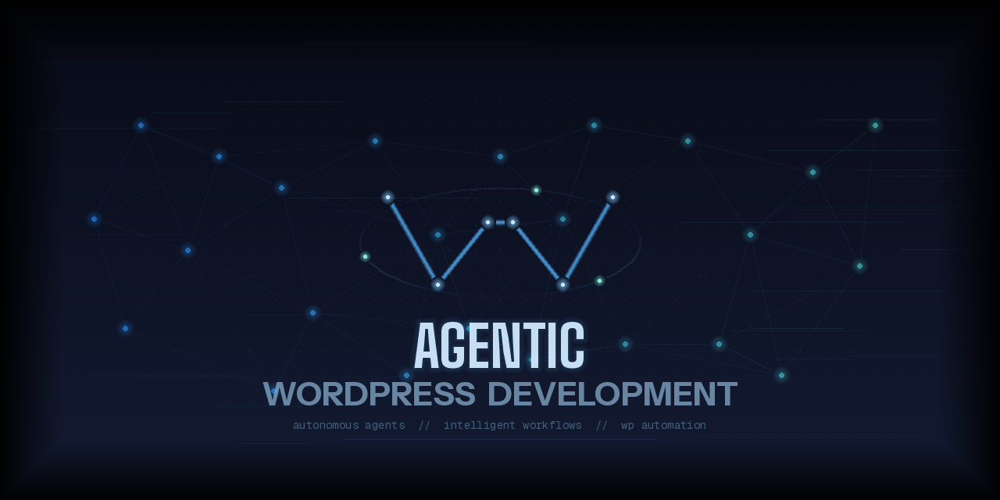

# WordPress Design & Marketing Skills for Claude Code

A Claude Code plugin marketplace with 21 skills and a shared 12-agent library covering WordPress design, SEO, marketing, content creation, and local business consulting. Three-tier agent architecture (haiku → sonnet → opus) with 14 API integration tools.

## Table of Contents

- [Skills](#skills)
  - [WordPress & Site Building](#wordpress--site-building)
  - [SEO & Technical](#seo--technical)
  - [Marketing & Conversion](#marketing--conversion)
  - [Content & Strategy](#content--strategy)
  - [Developer Tools](#developer-tools)
  - [Shared Agents](#shared-agents)
  - [Marketing Integrations](#marketing-integrations)
- [Installation](#installation)
  - [Install all skills (recommended)](#install-all-skills-recommended)
  - [Install individual skills](#install-individual-skills)
  - [Manual install](#manual-install-copy-skills-directly)
- [Usage](#usage)
- [Setting Your Brand & Site Guidelines](#setting-your-brand--site-guidelines)
- [Adding a New Skill](#adding-a-new-skill)
- [Repository Structure](#repository-structure)
- [Sources & Attribution](#sources--attribution)
- [License](#license)
- [Contact](#contact)

## Skills

### WordPress & Site Building
| Skill | Description |
|-------|-------------|
| `wordpress-design` | Theme design across block themes (FSE), classic themes, and page builders. ACF content modeling, performance optimization, 9-section audit checklist. |
| `wordpress-security` | Security audit — core/plugin/theme updates, authentication, file permissions, HTTP headers, information disclosure, malware detection. 80+ checks, 0-100 health score. |
| `wordpress-issue-debug` | WordPress issue debugger. Diagnoses errors, broken layouts, white screen of death, 500/503 errors, plugin conflicts, PHP fatal errors, database errors, and redirect loops. Works with or without a live URL. |
| `chatbot-creator` | End-to-end chatbot creation with 5 specialized agents: architecture design, implementation scaffolding, prompt quality review, security/guardrails audit, and conversation UX design. Supports WordPress widgets, Slack, Discord, WhatsApp, and custom APIs. |

### SEO & Technical
| Skill | Description |
|-------|-------------|
| `market-seo-audit` | Multi-agent SEO diagnostic. Branches by site type: local triggers market-local-visibility-researcher, blogs trigger market-on-page-seo-scorer, competitors trigger market-seo-comparison. |
| `local-business-site-audit` | Parallel audit via market-site-analyzer + market-local-visibility-researcher + market-competitor-profiler, synthesized by market-strategic-synthesis. Client-ready report for lead generation. |
| `market-seo-schema-markup` | JSON-LD structured data — Organization, Article, Product, FAQ, LocalBusiness, and more. |
| `content-blog-optimize` | Post-writing SEO + AI citation readiness. Delegates to market-on-page-seo-scorer (mode: ai-citation). Pass/fail table with specific fixes plus citation capsules. |

### Marketing & Conversion
| Skill | Description |
|-------|-------------|
| `marketing-copywriting` | Marketing copy for any page — headlines, CTAs, value propositions, page structure. |
| `content-refine` | All-in-one content editing. Runs ai-writing-detector + copy-quality-scorer in parallel, then removes AI patterns, tightens prose, fixes passive voice, converts features to benefits. |
| `marketing-page-cro` | Conversion optimization. Parallel market-site-analyzer + copy-quality-scorer then CRO judgment: value prop, CTAs, trust signals, friction audit, page speed impact. |
| `marketing-email-sequence` | Email sequences — welcome, nurture, re-engagement, onboarding, lifecycle automation. |
| `market-competitor-alternatives` | Competitor comparison and alternative pages — vs pages, positioning, feature matrices. |
| `marketing-lead-magnets` | Lead magnet strategy — checklists, templates, guides, gating, distribution. |
| `marketing-launch-strategy` | Product launch planning — 5-phase approach, Product Hunt, post-launch marketing. |
| `marketing-experimentation` | Full A/B testing lifecycle: hypothesis design (ICE scoring), tool selection, implementation, QA validation via ab-test-validator, result analysis, program management. |

### Content & Strategy
| Skill | Description |
|-------|-------------|
| `content-strategy` | Multi-agent content strategy: market-competitor-profiler + market-serp-researcher + market-review-miner → market-strategic-synthesis. Pillar architecture, cluster plans, AI citation strategy, 90-day roadmap. Includes blog strategy. |
| `content-blog-write` | Blog articles optimized for Google rankings and AI citations. 12 content templates. |
| `market-customer-research` | Two modes: analyze existing assets (transcripts, surveys) OR mine online sources via market-review-miner + market-serp-researcher. VOC themes, customer language patterns, persona sketches. |
| `market-competitor-research` | Multi-agent competitive intelligence: market-site-analyzer + market-competitor-profiler + market-segment-classifier → market-seo-comparison → market-strategic-synthesis. Threat assessment + 90-day action plan. |

### Developer Tools
| Skill | Description |
|-------|-------------|
| `skill-builder` | Interactive skill and agent builder. Walks through tier selection, naming conventions, and all required sections. Creates the agent file and registers it in the manifest. |

### Shared Agents

12 agents in 3 tiers. Invoked by skills — not used directly.

**Tier 1 — haiku (data collection)**

| Agent | Returns |
|-------|---------|
| `market-site-analyzer` | Meta tags, headings, schema, PageSpeed, robots.txt, sitemap, AI crawler access |
| `market-competitor-profiler` | Homepage analysis, content depth, AI citation readiness, reviews, social presence |
| `market-local-visibility-researcher` | Local search presence, directory citations, local pack results, NAP consistency |
| `market-serp-researcher` | SERP positions, competitor set, AI Overview signals |
| `market-review-miner` | G2, Capterra, Yelp, Google, Reddit reviews with verbatim quotes + theme tags |
| `ai-writing-detector` | Em dash density, AI-tell phrases, filler intensifiers. Score 0–100 |
| `ab-test-validator` | Test script presence, anti-flicker, caching headers, variant assignment, performance |
| `market-segment-classifier` | Industry vertical, business model, target segment, pricing model, value prop |

**Tier 2 — sonnet (analysis)**

| Agent | Returns |
|-------|---------|
| `market-on-page-seo-scorer` | Title/meta/headings/links/OG/schema/AI-readiness. Modes: `blog-post`, `landing-page`, `ai-citation` |
| `market-seo-comparison` | Cross-competitor keyword visibility, content footprint, technical comparison, authority signals |
| `copy-quality-scorer` | Value prop clarity, headline strength, CTA quality, passive voice, readability, benefit ratio |

**Tier 3 — opus (strategy)**

| Agent | Returns |
|-------|---------|
| `market-strategic-synthesis` | Positioning maps, threat assessment, gap analysis, SEO battle plans, 90-day action plans |

### Marketing Integrations
API integration guides and zero-dependency Node.js CLIs under `tools/`.

| Tool | Description | CLI |
|------|-------------|-----|
| `adobe-analytics` | Enterprise analytics — report suites, eVars, cross-channel attribution. | Yes |
| `calendly` | Scheduling — event types, invitees, availability, webhooks. | Yes |
| `close` | SMB CRM — leads, contacts, opportunities, sales pipeline. | Yes |
| `firehose` | Real-time web monitoring — competitive intel, brand mentions, Lucene queries. | No |
| `google-ads` | PPC campaigns — GAQL queries, ad groups, keywords, performance reports. | Yes |
| `google-search-console` | SEO data — search performance, URL inspection, sitemaps, keyword opportunities. | Yes |
| `linkedin-ads` | B2B advertising — URN-based campaigns, job title targeting, lead gen forms. | Yes |
| `outreach` | Sales engagement — sequences, prospects, outbound campaign management. | Yes |
| `paddle` | SaaS billing — subscriptions, products, pricing, transactions, tax compliance. | Yes |
| `posthog` | Product analytics — event tracking, session replay, feature flags, HogQL. | No |
| `segment` | Customer data platform — event routing, identity resolution, audience management. | Yes |
| `tiktok-ads` | Video advertising — campaign management, audience targeting, performance analytics. | Yes |
| `wordpress` | WordPress REST API and WP-CLI — posts, pages, media, categories. See `wordpress-design` for themes. | No |
| `zapier` | Workflow automation — Zap management, webhooks, task history. | Yes |

## Installation

### Prerequisites

- [Claude Code CLI](https://docs.anthropic.com/en/docs/claude-code/overview) installed and authenticated

### Install all skills (recommended)

```bash
curl -fsSL https://raw.githubusercontent.com/lcrostarosa/agentic-wordpress-devkit/main/install.sh | bash
```

Installs to `--scope project` by default (writes to `.claude/settings.json`). Pass `user` or `local` to change scope:

```bash
curl -fsSL https://raw.githubusercontent.com/lcrostarosa/agentic-wordpress-devkit/main/install.sh | bash -s user
```

### Install individual skills

```bash
# Add the marketplace first
/plugin marketplace add lcrostarosa/agentic-wordpress-devkit

# Install shared agents (required for multi-agent skills)
/plugin install agents@agentic-wordpress-devkit

# Install any skill by name
/plugin install wordpress-design@agentic-wordpress-devkit
```

### Manual install (copy skills directly)

```bash
git clone https://github.com/lcrostarosa/agentic-wordpress-devkit /tmp/agentic-wordpress-devkit

mkdir -p /path/to/your-project/.claude/skills
cp -r /tmp/agentic-wordpress-devkit/plugins/market-seo-audit/skills/market-seo-audit \
      /path/to/your-project/.claude/skills/

rm -rf /tmp/agentic-wordpress-devkit
```

## Usage

Once installed, skills activate by natural language:

```
"Help me build a block theme for a restaurant website"
"Audit this WordPress site before we redesign it"
"Run an SEO audit on https://example.com"
"What should we blog about? Plan a content strategy"
"Write a blog post about smart home installation costs"
"Score this post for AI citation readiness"
```

## Setting Your Brand & Site Guidelines

Create a `product-marketing-context.md` file in your project and skills will read it automatically — no more answering the same intake questions every session.

### Where to put it

```
your-project/
  .agents/
    product-marketing-context.md   ← create this file
```

### What it does

Every skill that asks questions (marketing-copywriting, market-seo-audit, content-strategy, content-blog-write, marketing-page-cro, marketing-email-sequence, and more) checks for this file first. If it exists, the skill skips any questions already answered and uses your context directly. One file, all skills.

### Get the template

One-shot — copies the template into your project and opens it for editing:

```bash
mkdir -p .agents && curl -sL https://raw.githubusercontent.com/lcrostarosa/agentic-wordpress-devkit/main/templates/product-marketing-context.md -o .agents/product-marketing-context.md
```

The template is also available at [`templates/product-marketing-context.md`](templates/product-marketing-context.md).


## Adding a New Skill
The Claude.md file specifically has instructions to reference [skill-authoring](guides/skill-authoring.md) and [agent-authoring](guides/agent-authoring.md)

Feel free to contribute, follow [contribution guide](CONTRIBUTING.md)

### Tips

- **You don't need every field.** Fill in what you know. Skills use what's there and ask only for what's missing.
- **Keep it current.** Update it when your positioning, offer, or ICP changes — all skills will pick it up automatically.
- **Short is fine.** A three-line business description beats a blank file.
- **Multiple projects.** Create a separate file per project if you manage more than one site. The file lives in the project directory, so skills use the right context per project.

---

## Repository Structure

```
.claude-plugin/
  marketplace.json              # Plugin catalog (21 entries)
agents/
  .claude-plugin/plugin.json   # Single manifest for all agents
  ...
plugins/
  {skill-name}/
    .claude-plugin/plugin.json  # Plugin manifest
    skills/{skill-name}/
      SKILL.md                  # Orchestrator entry point
      references/               # Domain knowledge (optional)
      evals/                    # Test scenarios (optional)
tools/
  REGISTRY.md                   # Integration index with capabilities
  integrations/                 # API guides per tool (14 tools)
  clis/                         # Zero-dependency Node.js CLIs (11 tools)
```

## Sources & Attribution

- **wordpress-design, wordpress-security, wordpress-issue-debug, market-seo-audit, local-business-site-audit, chatbot-creator** — Original skills
- **marketing-copywriting, content-refine, marketing-page-cro, content-strategy, marketing-email-sequence, market-seo-schema-markup, market-competitor-alternatives, market-competitor-research, marketing-lead-magnets, market-customer-research, marketing-launch-strategy, marketing-experimentation** — Distilled from [coreyhaines31/marketingskills](https://github.com/coreyhaines31/marketingskills) (MIT)
- **content-blog-write, content-blog-optimize** — Extracted from [claude-blog](https://github.com/agricidaniel/claude-blog) plugin (MIT)

## License

MIT

## Contact

Built by Lucas Crostarosa - [allthingslucas.fyi](https://allthingslucas.fyi) · [LinkedIn](https://linkedin.com/in/lucas-crostarosa)
